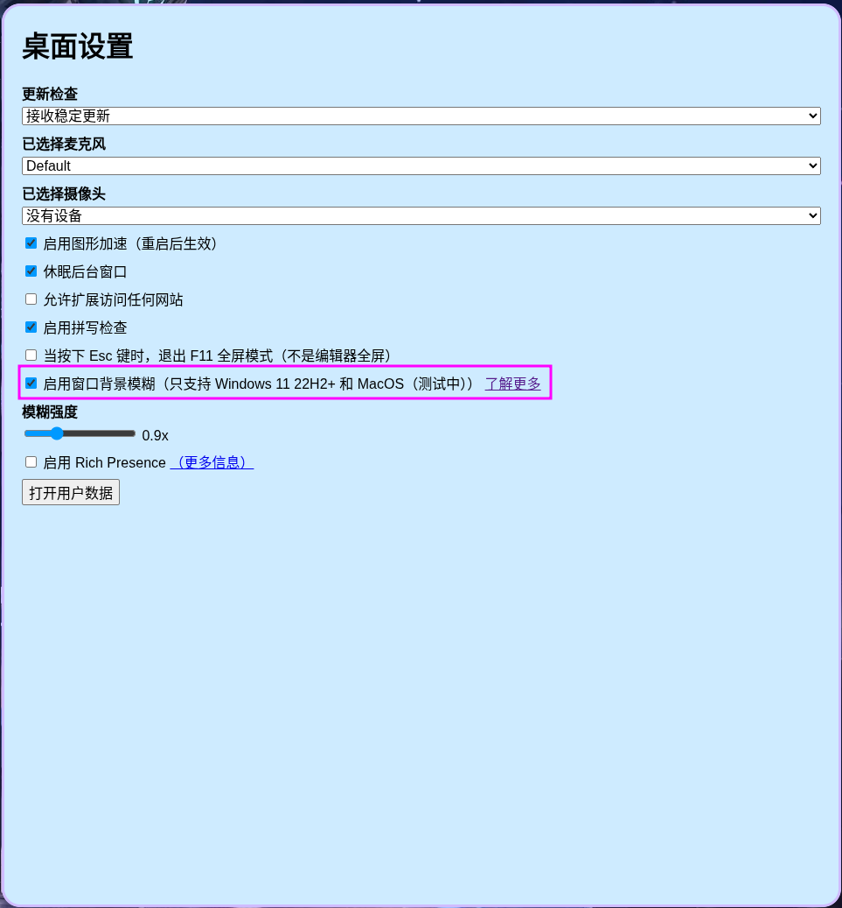
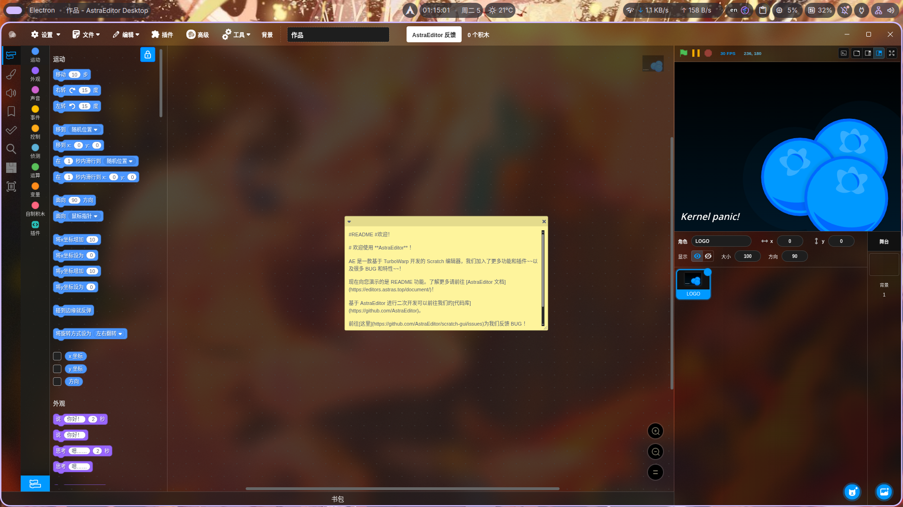

# 模糊

`AstraEditor` 支持您使用`窗口模糊`来让您的编辑器缤纷多彩

> 窗口模糊功能仅支持 MacOS、Windows 11 22H2+ ，且MacOS不保证完美可用。

# Windows

## Windows 11 22H2+
恭喜你！在 Windows 11 22H2+ 中启用`窗口模糊`非常简单，仅需在`桌面设置`中启用`启用窗口背景模糊`即可！


## Windows 11 22H2-
不好的是，`AstraEditor`无法在此版本启用`模糊`，幸运的是，`AstraEditor`仍可以为您启用`窗口透明`，您可以尝试自己通过配置模糊来实现！

# MacOS

> 我们没有测试机来证明`MacOS`的模糊可以正常工作，如果您发现了问题，请点击  反馈！

# Linux

由于`API`问题，我们几乎无法为您提供**即开即用**的服务。但是幸运的是，部分桌面环境拥有对于添加**模糊**的支持，但是需要您**手动配置**

让我们列举下 `niri` 环境的配置教程

## niri
> Niri 是一个支持滚动和平铺功能的 Wayland 合成器

!!! warning "注意啦"
    自带的模糊需要在 `26.04` 或更高版本或者单独的分支才能用！

在`桌面设置`中启用`启用窗口背景模糊`


然后打开您的`niri`配置文件，它通常在
``` bash
~/.config/niri/config.kdl
```
我们建议您**备份**一下文件以防止更改错误，尽管`niri`基本不会因为配置错误而*炸掉*。

打开后，您需要编写如下内容：
```
window-rule {
    match app-id="astraeditor-desktop"

    clip-to-geometry true

    background-effect {
        xray false 
        blur true
        noise 0.05
        saturation 3
    }
}
```
> 若您处在开发环境，需要把`match app-id="astraeditor-desktop"`改成`match app-id="Electron" title="AstraEditor"`
您可以直接在末尾追加这一串代码。下面将介绍代码的用途。

|命令|用途|
|--|--|
|`match app-id="astraeditor-desktop"` | 匹配`id`为`astraeditor-desktop`的应用|
|`clip-to-geometry true`|将窗口内容裁剪到其几何边界内，防止内容溢出|
|`background-effect`|设置背景效果|
|`xray false`|透出窗口后全部内容，若为`true`则仅透出桌面壁纸|
|`blur true`|启用模糊|
|`noise 0.05`|增加`0.05`噪点数|
|`saturation 3`|设置色彩饱和度为`3`(默认为`1`)|

> 更多配置参考 [niri/Configuration/A-Window-Rules](https://niri-wm.github.io/niri/Configuration%3A-Window-Rules.html#popups) 和 [niri/Window-Effects](https://niri-wm.github.io/niri/Window-Effects.html)

保存文件，然后打开`AstraEditor`，您就可以获取完整的`窗口背景模糊`了！

