# README

README 功能可以以`Markdown`形式渲染特定的注释，让其它人了解你的项目。

!!! info "信息"
    `AstraEditor 1.2.0`可以直接在工作区右键快速创建一个README啦！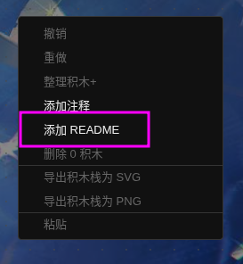

!!! warning "注意啦"
    每个README仅会在自己的角色/舞台内显示，而不互通

## 创建

首先，你需要创建一个新的注释

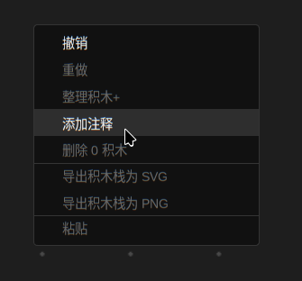

在其中填入以
```
#README
```
开头的文本，并在后面填入`Markdown`格式的内容

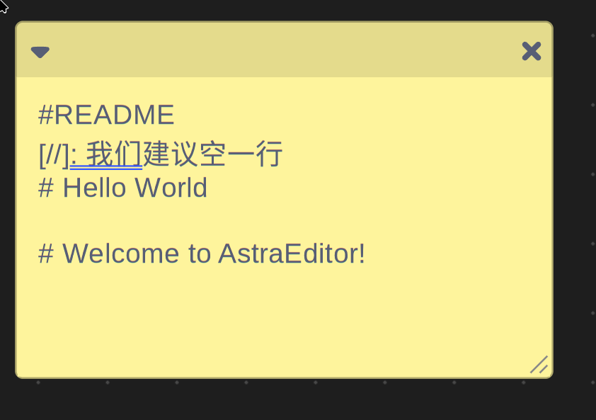

完成后，上方（或左方）会多出一个按钮：

 - 启用“VScode 布局”

    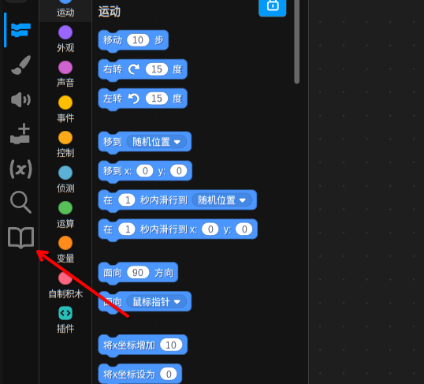

 - 未启用“VScode 布局”

    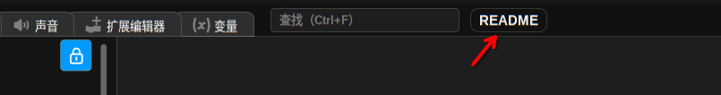

点击它，就能看见README了！

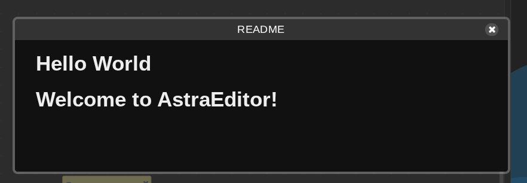

## 特性

### 多README
你可以创建多个README，并查看。
举个例子，我们创建3个README：

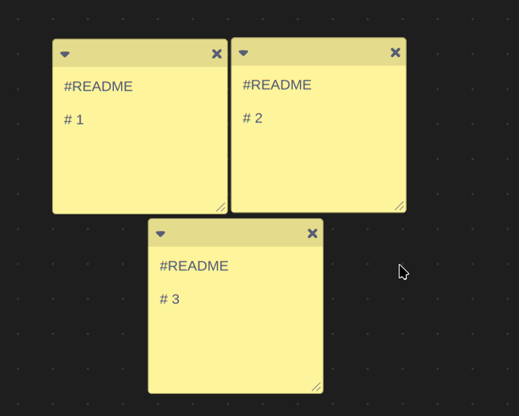

以同样的方式打开：

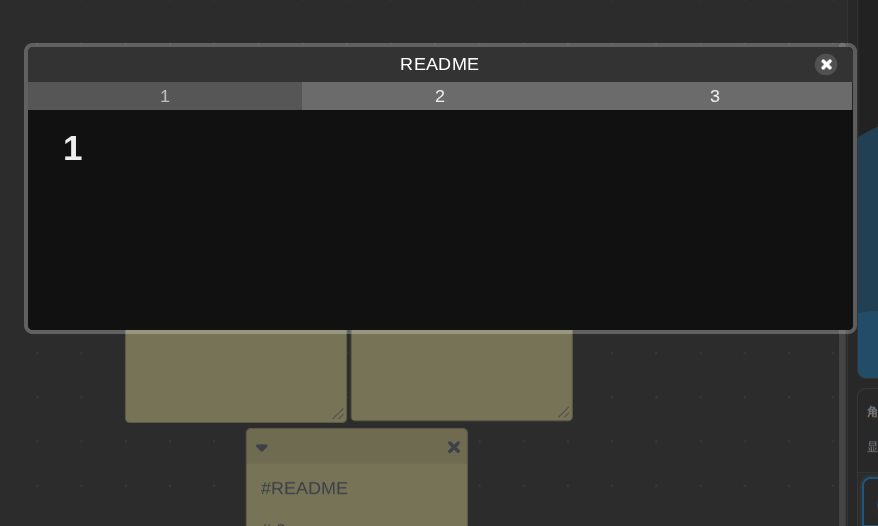

是的，上面出现了一个**选择菜单**，你可以切换他们！

### 标题
如果你需要为一个个功能制作一个单独的README,但是默认的以序号为标题难以区分的话，你可以将开头改为：
```
#README #标题
```
举个例子：
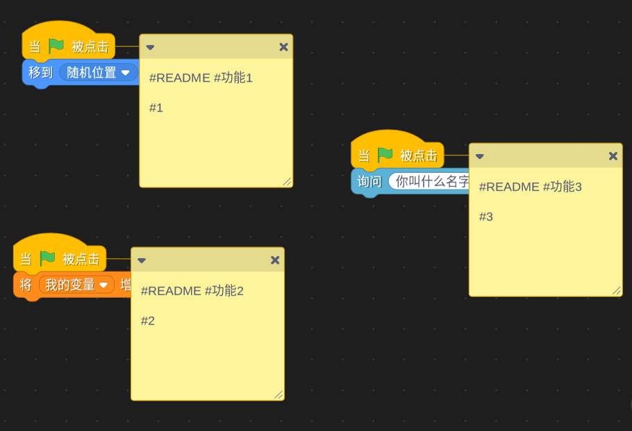

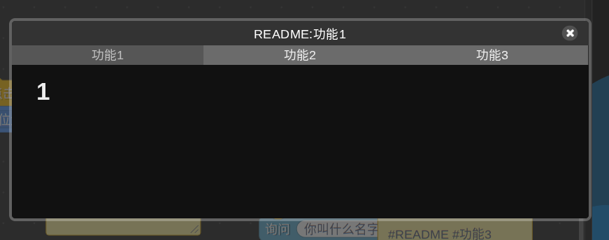

### 自动打开
如果你希望当打开项目的时候自动打开README来告诉用户一些信息，那就接着看下去吧！

在制作之前，请确认你启用了“自动显示README”，不然测试时可能会不按预期运行。

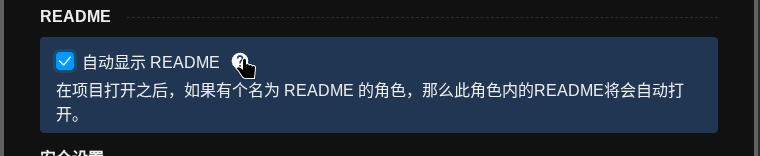

然后你需要创建一个名为“README”的新角色，你可以在此随便编辑，只要名字不变就行。

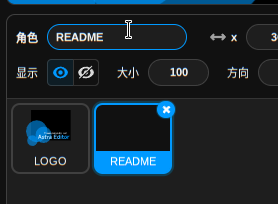

同上，编写一个README并保存。这样，只要用户启用了“自动显示README”，当项目加载完成后这个角色的README就会自动显示出来了！

## 兼容

我们使用`react-markdown(4.3.1)`，所以会出现部分不兼容的`Markdown`语法，这在未来会得到扩充。
现在，这个功能大致支持：
``` markdown
标题    # H1, ## H2, ### H3, #### H4, ##### H5, ###### H6
加粗    **BOLD** 或 __BOLD__
斜体    *ITALIC* 或 _ITALIC_
删除线    ~~STRIKETHROUGH~~
列表    无序: - ITEM, * ITEM, + ITEM; 有序: 1. ITEM
链接    [TEXT](URL)
图片    
引用    > QUOTE
代码    行内: `CODE`; 代码块: ```CODE``` (或缩进4空格)
任务列表    - [ ] TASK, - [x] DONE
脚注    TEXT[^1] 和 [^1]: FOOTNOTE <!-- 可能有问题-->
```

